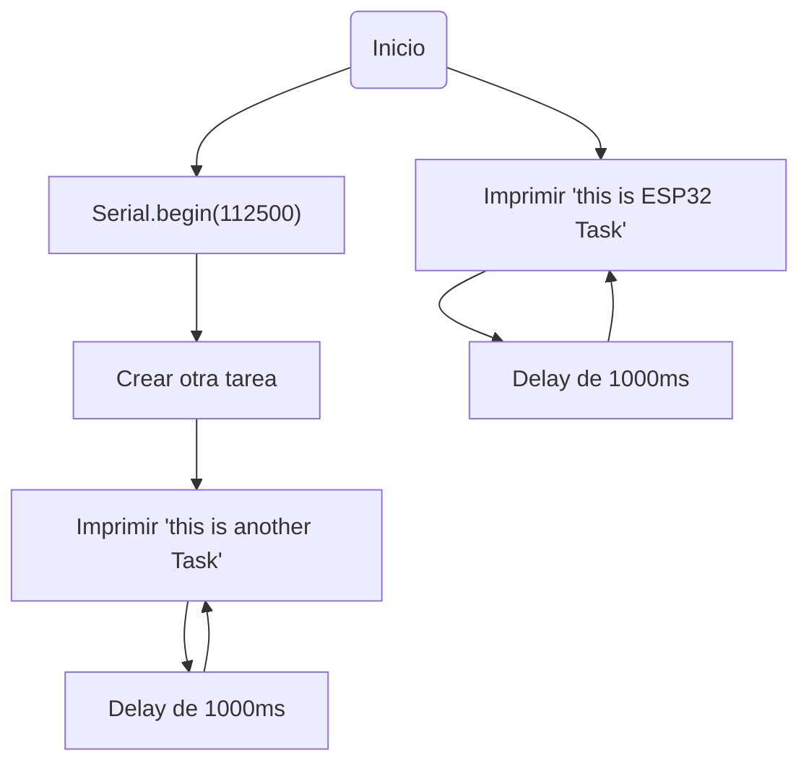

# Práctica 4: SISTEMAS OPERATIVOS EN TIEMPO REAL

## Introducción

Esta práctica se centra en los sistemas operativos en tiempo real y su capacidad para gestionar múltiples tareas de manera eficiente. Se asigna un período de tiempo específico para que cada tarea pueda ejecutarse, lo que permite dividir el tiempo de procesamiento entre ellas.

## Ejercicio práctico *parte 1*:
```c++
#include<Arduino.h>

void anotherTask(void *parameter);

void setup() {
  Serial.begin(112500);

  xTaskCreate(
      anotherTask,     
      "another Task",  
      10000,           
      NULL,             
      1,               
      NULL              
  );
}

void loop() {
  Serial.println("this is ESP32 Task");
  delay(1000);
}

void anotherTask(void *parameter) {
  
  for (;;) {
    Serial.println("this is another Task");
    delay(1000);
  }

  vTaskDelete(NULL);
}
```
### Funcionamiento y salida por terminal

Este código opera mediante la creación de dos tareas utilizando el sistema operativo en tiempo real FreeRTOS.

**Tarea principal**: Se ejecuta en la función *loop()*. Consiste en imprimir un mensaje ("this is ESP32 Task") repetidamente en el puerto serie y esperar 1 segundo entre cada impresión.

**Segunda tarea**: Creada en la función *setup()* y denominada "anotherTask". También imprime repetidamente un mensaje ("this is another Task") en el puerto serie y espera 1 segundo entre cada impresión.
Las salidas que se muestran por el puerto serie son las siguientes:
```
   - this is ESP32 Task
   - this is another Task
```
Adjunto diagrama de flujo del funcionamiento:

## Ejercicio práctico *parte 2* - *Semáforo*

```c++
#include <Arduino.h>
#include <FreeRTOS.h>
#include <task.h>
#include <semphr.h>

const int ledPin = 11;

SemaphoreHandle_t semaphore;

void setup() {
    Serial.begin(115200);
    pinMode(ledPin, OUTPUT);

    semaphore = xSemaphoreCreateBinary();
    
    xTaskCreate(encenderLED, "Encender LED", 1000, NULL, 1, NULL);
    xTaskCreate(apagarLED, "Apagar LED", 1000, NULL, 1, NULL);
}

void loop() {

}

void encenderLED(void *parameter) {
    for (;;) {
        digitalWrite(ledPin, HIGH);
        Serial.println("LED HIGH");
        delay(1000);
        xSemaphoreGive(semaphore); 
    }
}

void apagarLED(void *parameter) {
    for (;;) {
        digitalWrite(ledPin, LOW);
        Serial.println("LED LOW");
        delay(1000);
        xSemaphoreGive(semaphore); 
    } 
```

### Funcionamiento y salida por terminal

En el código previo, se presenta un programa que emplea un "*semáforo*" para gestionar dos tareas: una tarea enciende un LED y la otra tarea lo apaga. Notamos que el intervalo de tiempo definido por el *DELAY* es de 1 segundo. Esto significa que el LED se enciende y se apaga alternativamente cada segundo.

### Funciones utilizadas: 

Para llevarlo a cabo tenemos:

 - #### *Setup()* :
   Se realiza la inicialización de la comunicación serial y se establece la configuración del pin del LED como salida.

 - #### *Loop()*:
   No es necesario realizar ninguna acción en el bucle principal.

 - #### *EncenderLED() y apagarLED()*:
   Estas son las tareas que se llevarán a cabo simultáneamente. Ambas funciones consisten en bucles infinitos (for (;;)) que se turnan para encender y apagar el LED con un intervalo de un segundo.

### Salida puerto serie:

Alternando las 2 tareas, se imprime "LED HIGH" cuando el LED se enciende, y en la función apagarLED(), se imprime "LED LOW" cuando el LED se apaga. 

```
LED HIGH
LED LOW
LED HIGH
.
.
.
```
   
   
